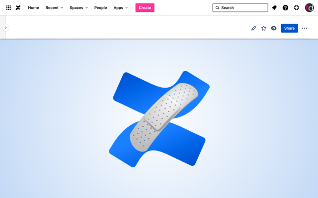

# Confluence stickier header Chrome extension

> because the Confluence sticky header isn't sticky enough 🩹🩹


This Chrome extension tries to make the Confluence experience better by disabling the sticky header "feature." It's a bit janky but works. 🤷🏻‍♀️

When you scroll to the top, the sticky header is reset, so you need to scroll down when it becomes invisible and then up again. When it kicks in again after being invisible for the first time, it'll re-disable it. To keep it disabled, avoid scrolling to the very top of the document.

[View the demo video](https://youtu.be/wV0j4JhSk38)




## Installation

1. Download the source code by clicking the Download button at the top right
2. Open Chrome's Extension management page
3. Turn on Developer Mode at the top right if it isn't on already
4. Click "Load unpacked extension"
5. Find this directory and load it in. The root of the directory needs to have the `manifest.json` file


## Distribution

The following command bundles the Chrome extension and includes only the necessary files for distribution:

```sh
./bundle.sh
```


## Changelog

| Version | Changes           |
| :------ | :---------------- |
| 0.0.1   | Initial release 🚀 |
